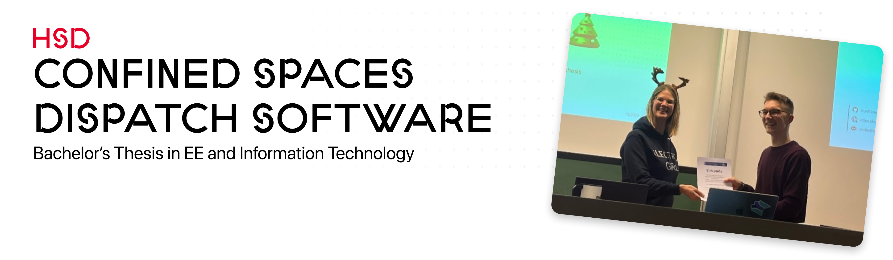
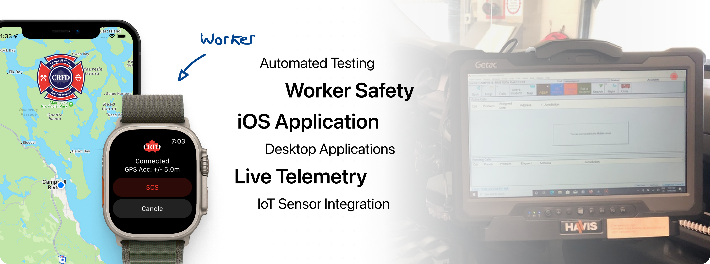

  

[Thesis PDF](https://opus4.kobv.de/opus4-hs-duesseldorf/frontdoor/deliver/index/docId/3757/file/Thesis-v20221005_201531.pdf) | [Ceremony Slides PDF](https://raw.githubusercontent.com/KuhlTime/bachelors-thesis/main/slides/VDE%20Presentation%208-Dec-2022.pdf)

As part of my bachelor's thesis I developed a software solution for improving security of workers in confined spaces. Through connected smart device emergency responders will get live telemetry of endangered workers.

**For this work I have been recognized with a promotional prize for the best bachelor's thesis in the field of electrical and information technology by the VDE Düsseldorf.**

For the listeners present at the ceremony I have given a brief 10-minute talk of my thesis and showed an interactive demo of the emergency system in action.

# 📄 View Thesis

  

**You can access the full publication via the official university servers under:**

[HSD Opus - Development of a Confined Spaces Dispatch Software for a Canadian Fire Brigade](https://opus4.kobv.de/opus4-hs-duesseldorf/frontdoor/index/index/docId/3757)

# 🔖 Abstract

This work focuses on designing an application ecosystem for a Canadian fire department. As it is part of the critical infrastructure, safety and code quality is of main concern. The thesis will go over the complete development life cycle, from planning to the actual implementation of a Computer-Aided Dispatch software for confined spaces.
It is looked into the Canadian legislation to derive application flows and data structure from it. At the end, the reader will have a thorough understanding of confined spaces and how to come up with a working application infrastructure.

# Questions

Feel more than welcome to contact me if you got any questions.

> What program have I used to write this thesis?

I am using a custom developed markdown to latex conversion script that allowed me to focus on writing instead of fiddling around with the right Latex format. 
You can use this template yourself [KuhlTime/hsd-markdown-thesis](https://github.com/KuhlTime/hsd-markdown-thesis)

# 📣 Attribution / License

This work is licensed under a <a rel="license" href="http://creativecommons.org/licenses/by/4.0/">Creative Commons Attribution 4.0 International License</a>.

You are free to:

- **Share** — copy and redistribute the material in any medium or format
- **Adapt** — remix, transform, and build upon the material for any purpose, even commercially. 

Under the following terms:

- **Attribution** — You must give appropriate credit, provide a link to the license, and indicate if changes were made. You may do so in any reasonable manner, but not in any way that suggests the licensor endorses you or your use. 
- **No additional restrictions** — You may not apply legal terms or technological measures that legally restrict others from doing anything the license permits. 
