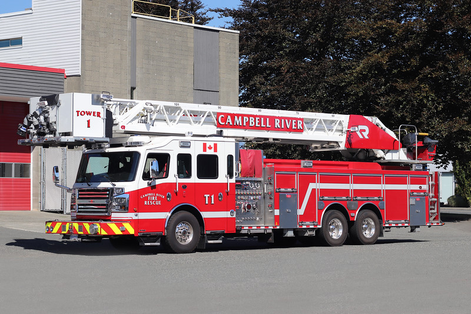

<!-- Goal: 700 Words -->

# Fundamentals

<!-- Related Software -->
## Computer-Aided Dispatch (CAD)

Computer-Aided Dispatch ((+CAD)), not to be misunderstood with Computer-Aided Design^[**Computer-Aided Design** misleadingly also referred to as CAD-Software is a software that's main purpose lays in the creation of digital construction plans and three-dimensional (3d) models. It is typically used in mechanical engineering, civil engineering and $\\$ electrical engineering. @autodeskinc_cad] is a special category of software that's helping to dispatch emergency services such as police and fire stations @wikipediacontributors_2021_computeraided. The software is used to provide a common flow for handling incoming emergencies -- to ensure a high agility and quick response to incoming emergency calls @usdepartmentofhomelandsecurity_2011_tech, @apcointernational_2012_public.

More modern implementations of such a software are oftentimes referred to as **Next-Generation 911** ((+NG911)). 911 being the common emergency number in North-America @wikipediacontributors_2022_911. Whereas traditional dispatchment software was focused on communication via "static land-line connections" @arcgisbyesriinc_ng911 (+NG911) focuses on providing advanced functionalities such as:

- processing of send video, audio and text messages @usnational911program_911gov
- the ability to receive data from different "transmitting devices such as wearable medical devices, car computers and building alarms" @usnational911program_911gov
- intercommunication between different departments and emergency services @usnational911program_911gov

These features allow for better emergency service through new ways of communication and enable faster response times to incoming accidents.

<!-- TODO: Rewrite -->
What most of these software products have in common is list of current emergencies and a map view that displays the location of any emergency units and the current incidents.
<!-- TODO: Add something -->

The fire department of Campbell River is currently using a (+CAD) software by a company called Centralsquare. @centralsquare_computeraided. Even though newer versions with more functionalities of that product do exist an older version is still used as the fire department is not directly in control of what software is allowed to be used on their official IT infrastructure.

{#fig:cad}

  <!-- TODO: What disptach softwares are out there? -->
  <!-- TODO: What have they been using so far? -->
  <!-- TODO: How do these softwares operate? -->

## Campbell River Fire Department

The city of Campbell River is located in the western part of Canada. It is the second-largest city on Vancouver Island. With a total population of more than 37,800 permanent residents @cityofcampbellriver_2019_connect.
The city is reachable by car, ferry, plane and seaplane and is about a 30-minute flight away from the metropolis of Vancouver.

<!-- TODO: Add Source -->
{#fig:map}

The Fire Department is covering the wider area of Campbell River. <!-- TODO: Ask Kelly for specific operation radius --> The main fire station is located near the city center and houses a wide range of different fire trucks and rescue vehicles. @a2022_campbell

{#fig:cr-tower}

A second, smaller fire station is located to the south of Campbell River and houses a second set of fire fighting vehicles @a2022_campbell.

Roughly 60% of all incoming emergencies happen to be medical calls, where the fire brigade is assisting with medical treatment of a patient. Approximately 10% of all responses are fire related and have to be extinguished. Besides these operations public assists, car accidents and false alarms are quite common. @bellefleur_2022_in

<!-- TODO: Where lay the operational differences between firebrigades here in Germany and Canada? -->

## Confined Spaces
<!-- TODO: Declutter, does not look good for opener -->
As defined by the Canadian Department of Justice, inside the **Occupational Health and Safety Regulations** ((+COHSR)) a **Confined Space** is met by the following criteria @canadiandepartmentofjustice_2022_sor86304 (11.01):

A space that...

a. is enclosed or partially enclosed;
b. is not designed or intended for continuous human
occupancy; and
c. has a limited or restricted means of entry or exit or
an internal configuration that could complicate provision of first aid, evacuation, rescue or other emergency
response.

<!-- What classification of cs are there? -->
A confined space can be classified as a **Hazardous Confined Space** when human health or life might be at danger due to one of the following conditions @canadiandepartmentofjustice_2022_sor86304 (11.01):

a. its design, construction, location or atmosphere;
b. the materials or substances in it; or
c. any other conditions relating to it.

A confined space is considered **Hot Work** if any source of fire or ignition is present. @canadiandepartmentofjustice_2022_sor86304 (11.01)

Figure @fig:csclassification shows a visual representation of the different kinds of confined spaces classifications.

{#fig:csclassification}

Inside a confined space one might encounter one or more of the following hazards @governmentofcanada_2021_confined, @mcpherson_2020_webinar:

- **Physical Hazard**
  like 
  *noise*, *engulfment*, *flooding*, *moving machinery*, *extreme temperatures*, *radiation*, *fire*, *explosions*, ...
- **Biological Hazard**
  like
  *mould*, *bacteria*, *viruses*, *blood-borne pathogens*, *biological toxins*, ...
- **Chemical Hazard**
  like
  *gases*, *vapors*, *fumes*, *chemical asphyxiant*, *lack of oxygen*, *asbestos*, *lead*, ...
- **Electrical Hazard**
  like
  *exposed wiring*, *electrical panels*, ...
- **Ergonomic Hazard**
  like
  *maintaining a difficult posture*, *repetitive strain*, *lifting*, *awkward reaching*, *use of hand tools*, ...
- **Psychological Hazard**
  like
  *working alone*, *claustrophobia*, *fatigue*, ...

<!-- TODO: List more exampled brought up in @governmentofcanada_2021_confined -->
Confined spaces are commonly part of a fabrication sites or public infrastructure and can be anything from a chemical tank to a sewage pipe. In order to protect workers entering these spaces, strict guidelines are put into place @bellefleur_2022_in, @governmentofcanada_2021_confined, @worksafebc_confined.

{#fig:draegerConfinedSpace}

<!-- TODO: Does there need to be an emergency responder on sight? -->

### Legislation <!-- TODO: Is it a regulation or legislation? -->

Before a person is allowed to enter a confined space the employer first needs to perform, what is called a confined spaces identification and a hazard assessment, as described in subsection 11.02 to 11.03 of the (+COHSR) @canadiandepartmentofjustice_2022_sor86304. From there on up a procedure for safe entry and exit can be established. Besides the (+COHSR) each state builds up on these fundamental regulations and adds their own definition upon these.

#### Identification

The identification process is a way of determining if there are any confined spaces on sight and whether they need to be classified as hazardous. Together with a qualified person, which is either someone from the work place committee or a health and safety representative the following actions are mandatory to be carried out:

1. The qualified person has to identify all confined and hazardous confined spaces.
2. The qualified person has to provide a catalog of all the confined and hazardous confined spaces that have been located in (1).
3. It is the employer's duty to properly sign these areas to prevent anyone from entering them.
4. The employer has to keep the record readily available. This document has to be updated / reviewed either every 3 years @canadiandepartmentofjustice_2022_sor86304 (11.03) or whenever the conditions of that particular confined space change.
5. Before someone is granted access to a **none**-hazardous confined space. The employer needs to ensure that safety measures such as "person-check and emergency response systems" @canadiandepartmentofjustice_2022_sor86304 (11.02(5)) are put into place.

The previously mentioned steps have been broken down to their core concepts. The full legislatory definitions are part of subsection 11.02 of the (+COHSR) @canadiandepartmentofjustice_2022_sor86304.

<!-- NOTE: A person is never allowed to enter a confined space on their own. They always need someone that  -->

#### Hazard Assessment

For every confined space the assigned qualified person has to produce a detailed hazard report. The report has to include the following information @canadiandepartmentofjustice_2022_sor86304 (11.03), @governmentofcanada_2021_confined:

<!-- TODO: Reorder list -->
- The date at which the hazard assessment was carried out.
- An extensive list of all the hazards a person entering that space may encounter. Each hazard has to have a resolution on how a certain threat can be prevented, controlled or extinguished.
- It needs to mention which equipment is required on site by the worker entering the space and what equipment might be required by the first aid responders.
- What checks and tasks have to be performed before someone is allowed access to the confined space.
- It needs to clarify the way of getting approval to enter that space.
- Any additional information for the worker or the emergency responders has to be stated.

<!-- TODO:  (2)(f) any situation in which an entry permit system is required. -->
<!-- TODO: What is an Entry Permit System? @governmentofcanada_2021_confined -->

Only persons that have certain training and are qualified to perform a hazard assessment are allowed to fill out such a report @canadiandepartmentofjustice_2022_sor86304 (11.03), @governmentofcanada_2021_confined. In case of any accidents that have to do with a lack of information on that report the person whose job it was to create the report might be held responsible and might face legal consequences. 
<!-- TODO: Find ressource legal consequences -->

<!-- TODO: Reread -->
Just like the identification of the confined spaces has to be reviewed every 3 years and updated as soon as any changes happen to that confined space the hazards have to be reassessed as well. An exception being when the confined space was not entered in the previous 3 years and is not planed to be entered @governmentofcanada_2021_confined. 

#### Establishing Procedures

From the previous two reports a procedure for a safe entry and exit of a confined space can be derived. The procedures will set up a roadmap for all the actors involved. Every confined space needs to have "safe entry and exit procedures", "two-way communication and person check systems" and "emergency response measures" @canadiandepartmentofjustice_2022_sor86304 (11.04(2)(a)). <!-- TODO: Not entirely sure! --> In case of a hazardous confined space the procedure plan has to state which safety tests need to be performed ahead of time and what equipment has to be prepared for both the workers and the emergency response personal. @canadiandepartmentofjustice_2022_sor86304 (11.04).

In case an entry permit system^[An **entry permit system** is a further safety system that includes a governing instance controlled by the employer. Its task is to schedule operations and hand out permits to the workers entering a hazardous confined space @usdepartmentofhomelandsecurity_2011_tech.] is in place the qualified person has to fill out a permit handed out by the employer. <!-- TODO: Rewrite --> A permit holds additional information about the hazardous confined space.  @canadiandepartmentofjustice_2022_sor86304 (11.04(3))

Depending on the type of hazard found in a confined space special rules and thresholds may apply. See subsection 11.05(1) of the (+COHSR).

<!-- TODO: Example @usdeperatmentoflabor_2018_confined -->

<!-- TODO: How does the flow of entering a confined space look like? Flow-Chart -->
<!-- TODO: What happens in case of an emegrency? -->
<!-- TODO: What equipment is needed to perform an operation inside a confined space? -->

### Regional Legislations

British Columbia ((+BC)) is the 3rd largest state and also the most western state of Canada @wikipediacontributors_2019_british. Additional to the laws and regulations published by the Canadian Department of Justice, through the (+COHSR) the British Columbian statutory authority^["A **statutory body** or **statutory authority** is a body set up by law (statute) that is authorized to implement certain legislation on behalf of the relevant country or state" @wikipediacontributors_2022_statutory] WorkSafeBC is responsible for concretizing these governmental laws.

Under subsection 9.37 'Provision of rescue services' of the WorkSafeBC extended (+COHSR) it is required, that any company has to supply a qualified rescue person on their own @governmentofbritishcolumbia_2021_bc (9.37(1)) or has to contract a 3rd party rescue service to perform a rescue if necessary @governmentofbritishcolumbia_2021_bc (9.37(2)). 

<!-- TODO: Let Kelly check if any of this is classified -->
The Fire Department of Campbell River provides this kind of service to local companies in their vicinity. Companies that claim their services have to sign a contract that enforces them to provide detailed information on their confined spaces described in *[2.2.1 Legislation](#legislation)*. Before workers are granted access to perform work inside a confined space they have to provide a form to notify the fire department of their intended start and end time. In addition to that the form has to state possible hazards, the lockout board location^[A **lockout board** or **lockout station** is a safety system that should prevent any hazards from happening by disabling and physically locking their functionality or control interface. When everything has been locked the key gets stored in a final container. Only the worker who is entering the confined space can remove all applied locks. That way it is made sure that no one can accidentally re-enable some functionality and cause an accident. @bellefleur_2022_in, @wikipediacontributors_2020_lockouttagout], the workers involved, information on entry and exit and the equipment required. Only after handing in that form and receiving the "get-go" from the fire departments operators -- they are allowed to begin their work. @bellefleur_2022_in

<!-- TODO: Add a user flow diagramm -->
<!-- TODO: If allowed provide the Confined Space Rescue Standby (Off‐Site) Request Form-->

### Standards

A standard is a guideline established by a group of expert in a certain topic. Whilst regulations and governmental laws build the basis, standards ensures that certain tasks are performed with a high safety and a repeatable efficiency @foundationofcannabisunifiedstandardsinc_standards. 
ß
Common standards for operating a confined space in Canada are the (+CSA) Z1006 and the (+NFPA) 350 @mcpherson_2020_webinar.

<!-- TODO: US and Canada closely related -->

### Hazard Diamond

In the (+NFPA) 704 "Standard System for the Identification of the Hazards of Materials for Emergency Response" the association has constituted a sign for quickly identifying and assessing the potential risks from any substances or materials @nfpanationalfireprotectionassociation_2022_nfpa. The sign is in the shape of a diamond and therefor often referred to as a "hazard diamond". 

<!-- TODO: @nfpanationalfireprotectionassociation_2022_nfpa + sap + Own depiction -->
{ #fig:diamond width=30% }

The diamond is divided up into four different colored sections (see Figure @fig:diamond), three of them showing a number with the associated risk level. Numbers range from $0$ (no-risk) to $4$ (highest-risk). Each color represents a different hazard:

  - Blue: Health Hazard
    - $0$: Normal Material
    - $1$: Slightly Hazardous
    - $2$: Hazardous
    - $3$: Extreme Danger
    - $4$: Deadly
  - Red: Fire Hazard
    - $0$: Will Not Burn
    - $1$: Above $200\text{°F} \text{ (}\approx 93\text{°C)}$
    - $2$: Below $200\text{°F} \text{ (}\approx 93\text{°C)}$
    - $3$: Below $100\text{°F} \text{ (}\approx 37\text{°C)}$
    - $4$: Below $73\text{°F} \text{ (}\approx 22\text{°C)}$
  - Yellow: Instability Hazard
    - $0$: Stable
    - $1$: Unstable if Heated
    - $2$: Violent Chemical Change
    - $3$: Shock and Heat may Detonate
    - $4$: May Detonate

Conversions from °F to °C were rounded down and have been taken from WolframAlpha @wolframalpha_2022_wolframalpha.

<!-- TODO: Fix Section -->
The white section remarks a special area where hazards like:

  - `ACID`: Acid
  - `ALK`: Alkali
  - `COR`: Corrosive
  - `OX`: Oxidizer
  - $?$: Radiation
  - $?$: Use no Water

All previous hazard descriptions have been taken from Michael Mulders' blog posting @mulder_2022_nfpa.

### Statistics

In Canada alone, the Canadian rescue training provider Roco Rescue recorded an average of 128 fatalities per year, in the timespan from 2011 to 2018 @rocorescueinc_2021_confined. With 61% most casualties happen due to physical injuries such as falling objects and engulfment. 34% account to atmospheric hazards like "toxic chemicals, oxygen deficiency or combustible dust" @mcpherson_2020_webinar.

As there are not a lot of statistics concerning injuries or fatalities in confined space, numbers may depend on the source of information.

In presentations by two engineers of 3M, they state that 60% of all casualties happen to would-be rescuers^[**Would-be rescuer** Rescuer that died during the rescue operation] @mcpherson_2020_webinar, @meyer_2019_confined. These numbers go back to a study from 1986 and are rendered incorrect by an Australian study from 2019, which has taken multiple source from many developed countries to come up with their own incident estimations. 

"In 1986, NIOSH issued an alert which concluded that ‘More than 60% of confined space fatalities occur among would-be rescuers’ (NIOSH, 1986). The sample size used to produce this alert was very small and had no stated selection criteria. [...] rescuer fatalities was much lower, and no more than 17% of all deaths" @selmon_2019_workrelated.

Because of the strict regulations put into place by the Canadian Government, deputy Chief K. Bellefleur can not remember a time when there has been any confined space accident in Campbell River in recent years. Most fatalities he says happen due to a lack of carefulness @bellefleur_2022_in. The problem with that being that training for this kind of rescue sometimes falls short as these events happen so infrequently if at all. As many of the abilities come down to well-trained risk assessment of their fire firefighters they will most likely be able to help a person in need, still there being a level of uncertainty when it comes to hazards that they not normally come across. @bellefleur_2022_in

<!--
 | Year | Casualties |
 | ---- | ---------: |
 | 2011 |        120 |
 | 2012 |         88 |
 | 2013 |        112 |
 | 2014 |        116 |
 | 2015 |        136 |
 | 2016 |        144 |
 | 2017 |        166 |
 | 2018 |        148 |

Table: Casualties per Year @rocorescueinc_2021_confined

\pgfplotstableread[row sep=\\,col sep=&]{
    interval & carT \\
    2011 & 120 \\
    2012 & 88\\
    2013 & 112\\
    2014 & 116\\
    2015 & 136\\
    2016 & 144\\
    2017 & 166\\
    2018 & 148\\
    }\mydata

\begin{figure}
  \begin{tikzpicture}
    \begin{axis}[
        ybar,
        symbolic x coords={2011,2012,2013,2014,2015,2016,2017,2018},
        xtick=data,
        ymin=0,
        ymax=180,
      ]
      \addplot table[x=interval,y=carT]{\mydata};
    \end{axis}
  \end{tikzpicture}
  \caption{Casualties per Year $@rocorescueinc_2021_confined$}
\end{figure} -->

### Training

In order for someone to be allowed access to a confined space they need special certification from training providers. In courses workers and emergency responders will learn about entry and exit procedures, risk management, hazard assessment and hazard control. @a3mcanada_2019_training, @worksitesafety_confined

<!-- NOTE: The CRFD acts as an emergency responder. As such it is obligated to have personal on hand when s -->

About 90% of firefighters at the Campbell River Fire Department have undergone thorough training in Rope and Confined Space Rescue @bellefleur_2022_in. Because they are a comparably small fire department "everyone has to be good at everything" @bellefleur_2022_in.

### Rescue

In case of an emergency inside a confined space there are three types of rescue operations with increasing amount of complexity and risk @selman_2019_confined: 

1. **Self rescue** Where entrants are able to evacuate the confined space on their own.
2. **Non-entry rescue** Entrants are unable to leave the confined space on their own but are able to be retrieved through an extraction system.
3. **Entry rescue** Entrants are unable to leave on their own and no extraction system is in place. A trained rescuer has to enter the confined space recover the person inside.

Australian researchers Jason Selman, Jeffrey Spicket, Janis Jansz and Benjamnin Mullis proposed a five-step resuce system they call **(+REALE)** @selman_2019_confined. The system should provide a framework for emergency responders to ensure a well-organized sequence of events.

A citation of these steps from their publication 'Confined space rescue: A proposed procedure to reduce the risks' @selman_2019_confined:

1. **Reconnaissance** of the rescue task
2. **Elimination** or reduction of hazards
3. **Accessing** the casualty, in which a minimal number of rescuers enter the confined space and make contact with the casualty.
4. Provision of **Life-saving** first aid to the casualty
5. **Extrication** of the casualty as required

<!-- TODO: What is the obligation of an emegency responder? -->
<!-- TODO: What do operators of the CRFD need to know about a confined space operation? -->
