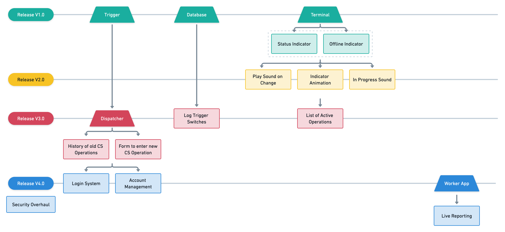

<!-- TODO: Find a better title for this chapter. -->
<!-- Goal: 500 Words -->
# Capabilities

<!-- What gaps / issues does the software need to address? -->
As the old software dropped support on managing confined spaces a new software should fill in the gaps. For a continuous improvement of the software, the software is divided up into multiple releases cycles with increasing amount of functionality and complexity. 

<!-- TODO: Fix Image Size -->
<!-- TODO: Remove In Progress Sound (Dublicate) -->

In order for the application to quickly be deployed into the field, the first two releases only consist of a very basic feature set to indicate whether there is an ongoing operation or not. With the releases the application should evolve into a more complex and feature-rich application.

The complete ecosystem should consist of multiple applications that should all fulfill a different purpose.

## Terminal

The Terminal application is deployed to the complete fleet of vehicles throughout the fire department. Each truck has one or more Windows based computers mounted to the dashboard of the vehicle and can run any installed Windows application.

When a confined space's operation is currently active an indicator should visualize to everyone on board that there might be a person in a dangerous situation. In case of an emergency, the fire department is required to dispatch enough personal to help with the rescue of the person.

<!-- TODO: Image of the Fire Truck -->

## Trigger
This application gets used by the dispatchers of the fire department. As the name implies it is a simple trigger application that

<!-- What hardware is the application deployed on? -->

## Dispatcher
With the introduction of Version 3 the Trigger application will be replaced by a better application that should allow dispatchers to control operations with far more precision.

<!-- TODO: Image of the Dispatchment Center -->

<!-- TODO: Add Mindmap -->

**Version 3.0**:

Through a custom build user interface the application should help operators to easily manage multiple confined operations

**Version 4.0**:

<!-- Map Feature -->
<!-- Search -->
<!-- Forms -->
  <!-- Hazard Assesment for new confined spaces -->
<!-- Warning when infromation of the confined space is outdated -->
  <!-- Warn the operator -->

## Worker

<!-- What requirements should the application fullfill? -->

<!-- Should future provness be a consideration? -->

<!-- How was the release schedule planed? -->
  <!-- Features -->
  <!-- Timing -->

<!-- What is the process of recieving a confined space? -->
  <!-- Create user flow diagrams -->

<!-- How is a protocol generated to  -->

