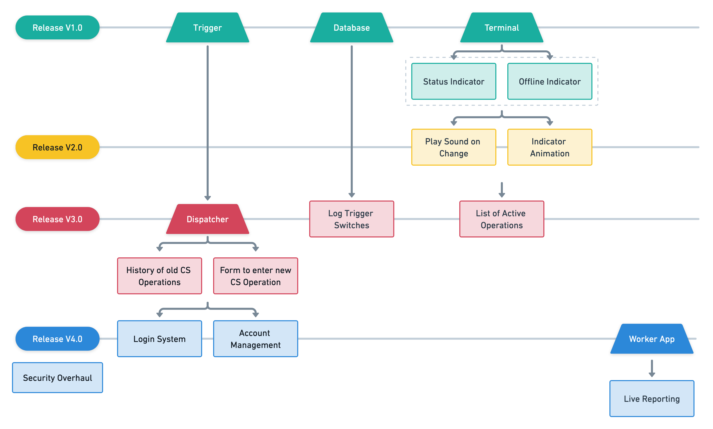

<!-- TODO: Find a better title for this chapter. -->
<!-- Goal: 500 Words -->
# Capabilities

<!-- What gaps / issues does the software need to address? -->
Canadian authorities prohibited the management of confined spaces through their current (+CAD) software the developed software should fill in these gaps that has left in the operation of the fire department. As the software was not designed to handle confined spaces, operators got creative and created pending emergency calls which should indicate that some workers would be in a confined space.

<!-- TODO: Figure number -->
The software should be rolled out in multiple release cycles with an increasing amount of functionality and complexity. As for the features required I have created a roadmap (Figure X) that indicates the functionality implemented in each cycle.

<!-- TODO: Fix Image Size -->
<!-- TODO: Remove In Progress Sound (Dublicate) -->

In order for the application to quickly be deployed into the field, the first two releases only consist of a very basic feature set to indicate whether there is an ongoing operation or not. With each release the application should evolve into a more complex and feature-rich application. Version 1 is the bare minimum of what is needed by the fire department. This would already drastically improve their safety concerning confined spaces, as they currently use sticky notes taped to the windshield of the vehicles to indicate that there is an ongoing confined space operation. @bellefleur_2022_in

<!-- TODO: Figure number -->
The complete ecosystem should consist of multiple applications that should each fulfill a different purpose. In the following subchapters I will explain -- what will be the purpose of each of the pieces of software and how they evolve through the different releases. I will list the requirements made by the fire department and add additional features and ideas that I came up with. See Figure X.

<!-- Based on: https://latex-tutorial.com/landscape-page/ -->

\begin{sidewaysfigure}[htbp]
    \centering
    \includegraphics[width=1.2\textwidth]{content/images/feature-mindmap.png}
    \caption{Feature Mind Map - Source: Author}
    \label{fig:nature}
\end{sidewaysfigure}

\newpage
## Terminal

<!-- TODO: Figure number -->
The Terminal application is deployed to the complete fleet of vehicles throughout the fire department. Each truck has one or more Windows based computers mounted to the dashboard or to the seats of the vehicle. See Figure X.

A small application, mimicking the functionality of a LED should indicate to everyone onboard that there is an active confined space operation. With that information the operators should be reminded that in case of any incoming emergencies they have to stuff or call additional personal to standby for any emergency that might happen inside that space. In case the incoming emergency requires the complete stuff of the fire department the workers inside the confined space have to be notified and may need to terminate their operation.

#### Version 1

The first version of the application should have the very basic feature of displaying the on and off state with an additional offline indicator to show whenever the data could not be retrieved from the backend.

#### Version 2

Building up on the first version. The terminal should now implement a sound whenever the state of the LED indication changes and maybe play a little animation to subtly get the attention of the one looking at the screen.

#### Version 3

As the application gets much bigger with 3rd version of the ecosystem. More data will be provided by the operators. This will give the opportunity to display a list of confined spaces inside the vehicle.

#### Version 4

In case of an emergency the application should present an easy guideline on how to respond and visualize the key aspects of the confined space.

## Trigger

This application runs on the operators desktop inside the dispatchment center. Whenever a worker calls in to enter a confined space and gets approval from the operators they are able to press a button that send that status change to all running *Terminal* applications inside the vehicles.

As the software is not allowed on the main dispatchment devices this application will most likely run external Microsoft Surface Pro tablets running Windows 10 standing next to the dispatchment screens of the operators. @bellefleur_2022_in

The first version of both the *Terminal* and the *Trigger* build up the basis on what the fire department is demanding.

#### Version 1 and 2

A simple button to toggle the confined space state on or off is more than enough.

#### Version 3 or higher

With Version 3 the *Trigger* application is no longer needed and will get replace by the *Dispatcher* which has lots more features and handles the triggering of the *Terminal* on its own.

## Dispatcher

With the introduction of version 3 the *Trigger* application will be replaced by a better application that should allow dispatchers to control operations with far more precision.

<!-- TODO: Important Metrics, like Oxygen requirements should be highlighted -->

#### Version 3

For the 3rd release cycle the fire department could imagine the following features being implemented into the dispatchment application:

- Static input forms to input information about an operation, such as:
  - Company name
  - Site address
  - Site name
  - Confined space id
  - Hatchwatch^[A **hatchwatch** is the person standing outside the confined space that is tasked with contacting the emergency responders in case of an incident.] name
  - Contact information
- A administration panel to see historic confined spaces operations

#### Version 4

This version should introduce some authentication process to access the data.

<!-- Map Feature -->
<!-- Search -->
<!-- Forms -->
  <!-- Hazard Assesment for new confined spaces -->
<!-- Warning when infromation of the confined space is outdated -->
  <!-- Warn the operator -->

## Worker

The *Worker* is a concept that I made an early prototype off. This application should introduce a new method for the worker to communicate with the fire department. I have imagined an app that can be installed on the workers phone. Inside the application access to a confined space can be scheduled and requested from the fire departments operators. When access is granted the phone will constantly send feedback and data back to the operators. In case the operation did not get canceled and the predetermined exit time gets exceeded operators get informed over a possible issue and be able to call for a sign of life.

Possible data that can be transmitted to the operators might include:

- GPS Location
- Phone Acceleration Spikes
- Battery Level
- Connection Strength
- When connected to a smartwatch, send health stats such as the workers' heart rate

This would open up new ways of responding to emergencies and give the workers an extra level of security. 

Although iOS usage on smartphones in Canada is quite high compared to Europe. The application should be developed for both major players iOS (57.3% @statcounter_2022_mobile) and Android (42.5% @statcounter_2022_mobile) to ensure maximum coverage.

<!-- What requirements should the application fullfill? -->

<!-- Should future provness be a consideration? -->

<!-- How was the release schedule planed? -->
  <!-- Features -->
  <!-- Timing -->

<!-- What is the process of recieving a confined space? -->
  <!-- Create user flow diagrams -->

<!-- How is a protocol generated to  -->

