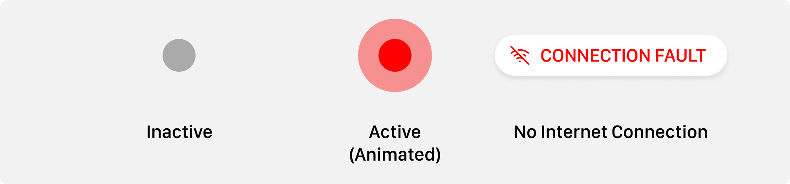

<!-- Goal: 12 pages -->
# System Design

As the whole ecosystem is made up of many smaller software pieces discussed in the previous part *[3 Capabilities](#capabilities)* many design considerations had to be made. In this chapter I will walk over all the important concepts I have come up with and will go into more detail the more this chapter progresses. First I will lay out general concepts on how the application should function. Later I will be more specific and explain the individual software libraries and technologies used in order to accomplish the previously set goals.

<!-- The chapter should describe the applications on a high level. Not the implementation. No languages and no code! -->

## Architecture

<!-- What is the architecture of this application? -->
  <!-- What do books recommend on how a good system architecture should look like? -->

<!-- How are the connections between the different Application modeled? -->

<!-- TODO: How should the application data be modeled? ERD Diagram -->

<!-- Does the software needs to be scalable? -->

<!-- What should be the maximum cost of the ecostytem? -->

## Quality

<!-- What qualitiy / security standards need to be set? -->
  <!-- What defines a software to be of high quality? - See:  Ensuring the Software Quality for Critical Infrastructure Objects -->
  
  <!-- What happens when there is no network connection? -->

### Reliability

<!-- How should issues and crashes be handled? -->
<!-- What Fallback is there in case of a malfuntion or a complete system outage? -->

### Safety
  <!-- What are common errors that need to be prevented? e.g. User error (Incorrect use), Network Connectivity -->
  <!-- How is the application protected against hackers? -->
  <!-- What attack surfaces does the application poses? -->
  <!-- What are the consquences of someone breaching different parts of the system -->
  <!-- How can this be prevented? -->

  <!-- How is future provness guaranteed? -->

## Interface Design

For the User Interface^[The **User Interface** ((+UI)) describes the visual style of an application @dumont_2021_ui] ((+UI)) and the User Experience^[The **User Experience** ((+UX)) describes the functionality of an application. As to *what steps need to be taken in order to perform a certain task*. When talking about a "good" (+UX) that generally means that a software is intuitive and easy to use.] ((+UX))

#### Terminal

abc

#### Trigger

#### Dispatcher

For the dispatchment application I have come up with a whole design system. That should bring a uniform U

<!-- TODO: Use the following passage somewhere -->
<!-- NOTE: A rescue is a balancing act between speed and safety. No rescue comes without risks that is why it is important to have only the most demanding information visiable that is vital to perform an operation. -->

#### Worker

<!-- How should the UI function? -->
<!-- How can incorrect usage of the application be prevented? How does the UI reflect these protections? -->
<!-- What DevOps Pipelines need to be developed? -->
<!-- What pages are needed for the Dispatcher? -->
<!-- UI components and their use cases? -->

<!-- How should Forms in the Dispatcher application should look like? What data is needed by the operator? -->

## Technologies
<!-- What technologies / libraries have been used? -->
  <!-- What part of the application is each software used for? -->
  <!-- What are the benefits / disadvantages of the technology used? -->

### VueJS

<!-- Who has created Vue? -->
<!-- React -->
<!-- What is reactivity? -->

#### Vite

### Electron

<!-- Multi-Platform -->
<!-- Compatibility -->
<!-- Tauri -->

### Firebase
<!-- What database should be used? What features should it poses? -->
  <!-- How is logging of changes enabled? -->

### Swift

### Flutter

## Testing
<!-- What is static Code Quality Analysis? How does it work? -->
<!-- What parts of the application need testing scripts in order to continously check their correct behaviour? -->
