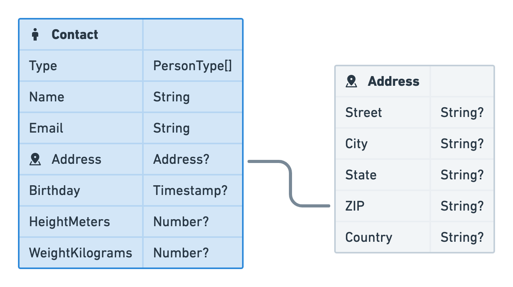
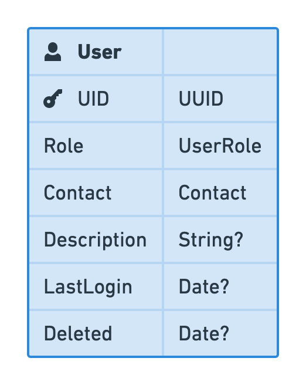
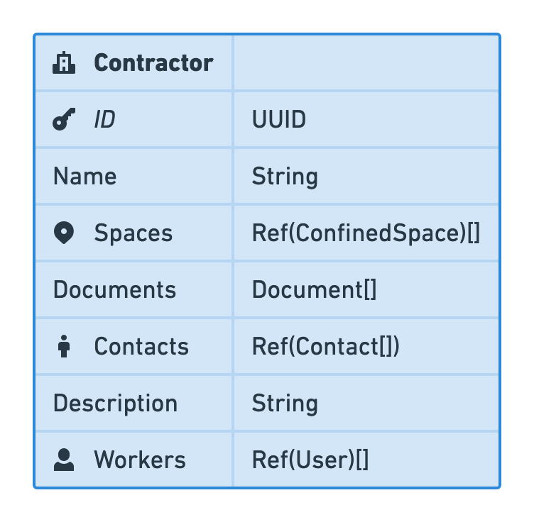
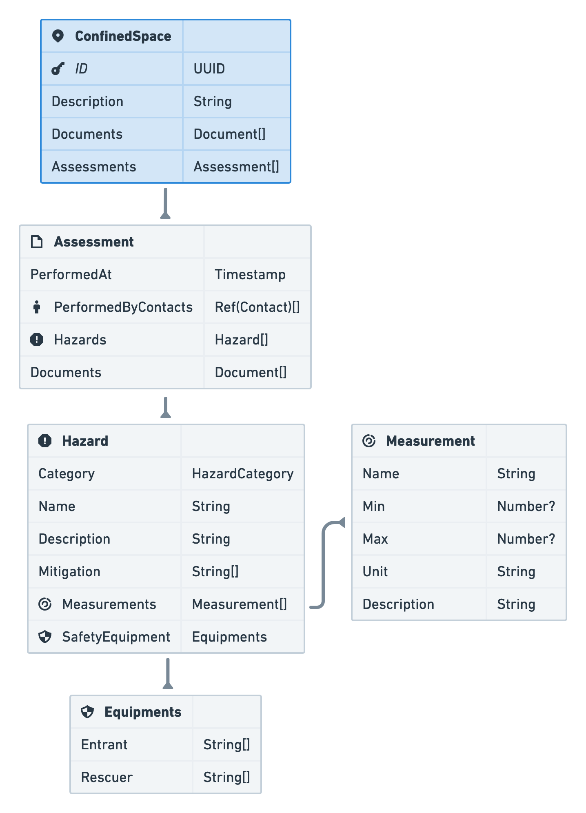
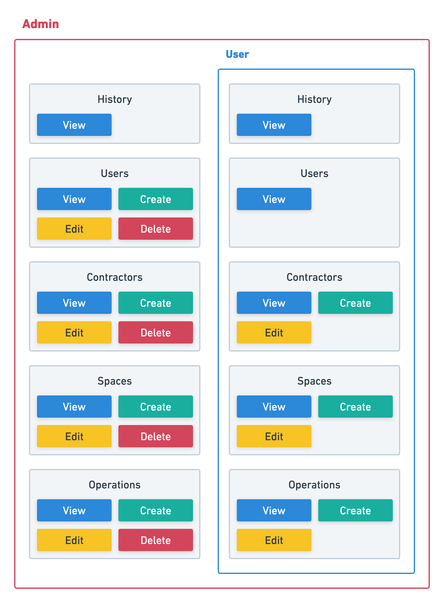

<!-- Goal: 12 pages -->
# System Design

<!-- TODO: Rewrite -->
As the whole ecosystem is made up of many smaller software pieces discussed in the previous part *[3 Capabilities](#capabilities)* many design considerations had to be made. In this chapter I will walk over all the important concepts I have come up with and will go into more detail the more this chapter progresses. First I will lay out general concepts on how the application should function. Later I will get more specific and explain the individual software libraries and technologies used in order to accomplish the previously set goals.

## Application Flows

For a good user experience the interactions with the software were designed before developing the applications. Each flow describes the way in which a fireman, an operator, a worker and an employer might work with the software to complete a certain task.

**Version 1 and 2** are rather limited -- their whole purpose is to simply signal and remind the fireman inside the fire trucks of any ongoing confined spaces operations. When approved by the operators they are able to press a button to notify all vehicles that there is a confined space operation running. As there are multiple operators inside the dispatchment center their triggering applications will also be informed about the status change.

**Version 3 and above** are way more complex. Following each functionality of the applications will be explained:

### Register a new Contractor

Local companies are required by law to either have an emergency responder on their own or have a contract with one @bellefleur_2022_in. Each new contractor of the fire department will be able to get registered inside the system. When creating a new client inside the software a form should ask for relevant information about the work place. As there has been a huge gab in the detail of any contractors' documentation about their work sites @bellefleur_2022_in some information should be made mandatory to be provided, to ensure consistency across all confined spaces. The documentation of some ranged from complete folders of documents, hazards assessments to almost no information at all @bellefleur_2022_in.

A copy of the contract and any other documents regarding the company should be uploaded to the system to remove the need for the operator to go through any folder and look for the documents. A physical copy should always be kept on hand in case of a system failure.

<!-- TODO: 3 year hazard report warning -->
<!-- TODO: Confirmation E-Mail for the Contractor to sign that the information is correct. -->


### Adding a Confined Space

Before an operation can be scheduled the confined space needs to be registered. This process is done by the operator entering the information the contractor provided. The operator will be guided through this process to ensure all relevant information is captured.

- Name of the confined space
- Location of the entry point
- Lock-out board location
- Measurement taken before entry
- Hazards to be expected in the confined space
- Date of the hazard assessment
- Mitigation measures to be taken
- Equipment to be used
- Emergency equipment to be used
- Further documentation and files

After entering the confined space into the system a verification about the correctness of the information will be requested from the company through an automated E-Mail or SMS.

Should the date of the hazard assessment be older than the maximum 3 years -- the operator is obliged to ask for an updated report. Shortly before the assessment is due the companies contact will receive an automated e-mail asking them for an updated report.

### Updating a Confined Space

Besides adding a confined space the operator should be able to update the information about a confined space. This may be needed when some conditions inside the confined space changed. As with the creation of a confined space and the accompanied hazard report the contact person has to confirm the correctness.

### Schedule Confined Space

<!-- What information about a confined space is required within the applcations? -->

<!-- NOTE: Each confined space needs to hold relevant information that should be concise and free of duplication. For the optimal application I have come up with a data model that should be extendable f -->

<!-- The chapter should describe the applications on a high level. Not the implementation. No languages and no code! -->

The employer should be able to schedule a confined space operation. This should either be possible by calling the operator, handing in a filled out form or by using the *Worker* application.

Scheduling the operations requires some important information:

1. Which Confined Space is the operation going to take place?
2. When is the Operation going to take place?
3. Who to contact in case of an emergency?
4. Who is going to enter the confined space?
   - What is the maximum number of workers entering the confined space at any time?
5. What work is going to be performed?
6. Additional Information?
   - Hazards that could occur that are not covered by the confined space?
   - Rescue Equipment to the equipment that has been covered by the confined space?

Should the selected space's hazard report be older than the maximum age of three years a warning is displayed that the employer first needs to provide an updated hazard report, or he needs to reaffirm that the information is still up-to-date.

After filling out all the information a review page should give a summary of the data that has been entered.

Once the operation has been scheduled the emergency contact will receive an E-Mail or an SMS with the information provided in the form. By clicking on a link provided inside the E-Mail or the SMS the emergency contact can confirm the captured information is valid.

### Entering a Confined Space

Any confined space operation has to be approved by the operators before someone is allowed entry. A request to enter a space can either be performed by calling in to one of the operators inside the fire department or by sending a request through the *Worker* application. Only if the confined space operation has been scheduled -- an entry can be approved. This gives the fire department and also the workers the confidence that all precautions have been met.

Should the entry be requested through the *Worker* application, the operator will receive a push notification asking him to give approval. In the time the operator needs to respond the one requesting the entry will be shown a waiting screen warning him to wait for approval. In case the operator is not responding the worker will be told to call in to the operator.

Each operation can be in one of eight different states:

  1. Scheduled
  2. Requested
  3. Canceled
  4. Approved
  5. Declined
  6. In Progress
  7. Emergency
  8. Completed

Once a request to enter the confined space has been made to the operators the request will either be approved or declined. A decline of the request may be caused due to a lack of information about the operation or a lack of emergency responders inside the fire department.

Both the cancelation and the decline of an operation require additional information to why it was called off. Most predominant reason being a valuation of the risks being off limits. But might also be due to a rescheduling of the operation or a lack of workers.

Each step gets documented with the time and date of the event. This will provide essential knowledge to prove the correct execution of each of the steps.

Should the whole fire department be busy with a huge emergency requiring all stuff the operators are able to decline all requests automatically and display a message to the *Worker* saying that operations are currently on hold.

### Declaring an Emergency

Should there be an emergency inside a confined space all applications switch into an emergency mode. Fireman and dispatchers are shown clear instructions on how to react corresponding to the previously mentioned **REALE** @selman_2019_confined guidelines. Additionally, any registered hazards and their resolutions will be shown in a clear and understandable way.

An emergency can be initiated in a variety of ways:

  * Someone makes a call to the fire department
  * A person on sight uses the *Worker* application to trigger an emergency
  * The *Worker* application has detected a sensor value exceeding a certain threshold
  * The operation has not been marked as completed by one of the workers and the operation has exceeded the scheduled time limit

## Data Model

<!-- TODO: Size all images to fit -->

For the whole application I have come up with a complex data model. I have tried to capture the most relevant information and created room for expansion where necessary. Inside the data model distinctions between the actual entity and nested type interfaces are being made. The nested objects provide further structure throughout the application, but unlike the entities these types are always stored inside an entity and therefor are not directly referenceable by any other object inside the database.

<!-- TODO: Add source (Eigene Darstellung) -->
<!-- TODO: Update -->
{#fig:erdShrunk}

Each entity has a unique identifier ((+UUID))^[A **Universally Unique IDentifier** or short **UUID** is generated from a set of five different algorithms which produce a 128 Bit long string that helps with unique labeling of data for better "sorting, ordering, and hashing of all sorts, storing in databases, simple allocation, and ease of programming in general". @leach_2005_a] by which to reference the particular document. Adding to that -- metadata information like a timestamp -- when the entity was last changed `LastUpdated` and a reference to the user who performed that change `LastUpdatedByUser` are added to each entity. The names are purposely chosen to only reflect the latest change. Any manipulation to a document gets stored inside a subcollection called `History`.

To keep data usage at a minimum the `History` subcollection does not store complete snapshots of the object but only holds the changes that have been performed on the previous data snapshot. Besides the actual change made to the object each change-document will always include the previously mentioned `LastUpdated` and `LastUpdatedByUser` fields. The Internet Engineering Task Force ((+IETF))^[The **IETF** or *Internet Engineering Task Force* is a standards body that focuses on developing and publishing standards for the open web. @ietfinternetengineeringtaskforce_2019_about] put out a Request For Comments ((+RFC))^[**(+RFC)** stands for *Request For Comments* and describes a standard published to the (+IETF). It is called *Request For Comments* as a standard is not directly recommended by the (+IETF) and requests to be evaluated by anyone @drjulianonions_2021_rfc, @nottingham_2018_how. It first has to go through a number of stages before it should be used in production by anyone. @emberjs_rfc] that describes how one might store changes made to a JSON object. The standard has been published in April 2013 under the name "JavaScript Object Notion (JSON) Patch" ([RFC 9602](https://www.rfc-editor.org/rfc/rfc6902.html)) by Paul C. Bryan and Mark Nottingham. @bryan_2013_rfc, @dharmafly_2022_json

It has been adapted by many existing libraries for all major programming languages @dharmafly_2022_json. It is therefor fairly straightforward to implement into the application.

As an example for the following object...

```json
{
  "foo": "abc",
  "bar": "def"
}
```

... a change using the [RFC 9602](https://www.rfc-editor.org/rfc/rfc6902.html) standard might look like this:

```json
[
  { "op": "replace", "path": "/bar", "value": "abc" },
  { "op": "remove", "path": "/foo" }
]
```

Each change inside the array describes one of 6 different case-sensitive operations that can be performed on the original data object. The operations `op` are:

  - `add`: Add a new property to the object.
  - `remove`: Remove a property from the object.
  - `replace`: Replace the value of a property.
  - `move`: Move a property to another location.
  - `copy`: Copy a property to another location.
  - `test`: Test that a property exists and has the expected value.

Only the `add`, `remove` and `replace` operations are of interest to this application.

With all of that information a history graph can be created and traversed to the user that created or modified the object at any point in time.

### Contact

{ #fig:erdContact width=80% }

A contact holds relevant information about an actor involved in the confined space process. The entity stores data like the persons name, address, phone number, email address and a selection of types to better identify the duty of the person. Each contact has a few mandatory fields and additional information like the persons body measurements which are optional^[Present in many modern programming languages an **optional value** is one that can deliberately be omitted. The absence of a value is often denoted by a special `undefined`, `nil` or `null` value. A type annotation often uses a `?` to indicate that the value is optional. @microsoft_2022_documentation, @appleinc_the] -- symbolized in Figure @fig:erdContact by the `?` question mark. These fields will most likely not be provided and are a demonstration of where additional fields might be implemented. Any frontend application accessing the data needs to be able to handle the absence of these values accordingly. 

As the contact information plays an important role for the traceability of information the contact object is not allowed to be deleted. The contact entity in Figure @fig:erdShrunk shows no connection to any other objects as the contact entity can be found all throughout the model structure.

### Users

<!-- TODO: Look where to put this -->
<!-- As with the `LastUpdatedByUser` metadata field any reference always has an indication of the entity that can be expected from that reference. -->

<!-- TODO: Update -->
{ #fig:erdUser width=30% }

Every person that wants to interact with the application has to be a registered user. Users have a role assigned to them. The `UserRole` field determines what operations the individual user is allowed to perform and which parts of the application he is allowed to access. 


<!-- TODO: What happens on user deletion -->

### Contractors

{ #fig:erdContractor width=40% }

Any institution that wants the fire department to be their emergency responder for any of their planned confined space entries has to sign a contract assuring the fire department that they will provide them with accurate information about their work place and the hazards that are to be expected inside their confined spaces. 

The contractor entity holds general information, like the companies name and information about whom to contact for any administrative or technical issues related to the work place. Furthermore, the contractor entity holds references to their confined spaces and their workers' user accounts. More on that later. 
<!-- TODO: Is more on that later been realized anywhere -->

Inside the `Documents` property the fire department is able to store any documents that are relevant to the work place, like the signed contract, maps, floor plans, etc. As for Firebase -- any files that have been uploaded will get stored inside the Firebase Storage service. The property inside the database document will then hold a URL to access the particular file.

### Confined Spaces

{ #fig:erdConfinedSpace width=75%  }

A confined space builds a vital part of the application. Each confined space object is referenced by a single contractor. As mentioned in *2.3.1 (Hazard Assessment)* the contractor has to conduct an assessment of the hazards that are to be expected inside the confined space. 

#### Assessment
For each confined space there are subsidiary assessment interfaces holding the information about who performed the assessment, a timestamp when the assessment took place, further documents and an array of hazards found inside that confined space. (See Figure @fig:erdConfinedSpace)

#### Hazard
In case of an emergency a hazard interface gives clear instructions on what to be expected when arriving at the scene. It states threshold values inside the `measurements` property that need to be checked before entry and potential mitigation strategies that have to be carried out. A possible hazard object might look as follows:

```json
{
  "category": "physical",
  "name": "Extreme Temperatures",
  "description": "Inside the machinary compartment temperatures 
    might exceed 50°C.",
  "mitigation": [
    "Turn off the machine.",
    "Open up emergency cooling vents."
  ],
  "measurements": [
    {
      "name": "Temperature",
      "min": null,
      "max": 65,
      "unit": "°C",
      "description": "The temperature inside the machinary 
        compartment."
    }
  ],
  "safetyEquipment": {
    "entrant": [
      "Drinking Water to prevent hidration",
      "Thermostate with an overheating alert",
    ],
    "rescuer": [
      "Heat resistive suite"
    ]
  }
}
```

### Operations

Each operation inside a confined space has to be announced by the contractor at least 24 hours prior to the start of the operation. Information inside the object includes the space where the operation is going to take place, the scheduled start and end-time of the operation, a description of the work that is going to be performed, the workers involved in the operation. The optional `ApprovedByUser` field gets filled by an operator as soon as he gives the get go for the operation. This field is only to be set 30 minutes before the scheduled start so that approval can only be gained judging the current workload of the fire department. For further documentation an optional `StartedAt` and `EndedAt` date can be used to track the actual start and end of the operation. Not mentioned rescue information can be specified in a string field called `RescueInformation`. 

#### Emergency Report

In case of an emergency each operation can have its own emergency report. The object is optional and can be used to further document what happened during the operation and what lead to the emergency.

### Capture Point

This entity enables some of the smart features that should set this software apart from other software packages and enables the (+NG911) aspect of the application. Any entrant using the *Worker* application has the ability to transmit live data back to the fire department. In a predetermined interval the app will send status updates that include the users' location, the battery level and the signal strength. Should a device be offline the data will be stored on device with a signal strength of 0 and transmitted as soon as the device is back online again. Should the workers phone stay offline for a long time the operator will get notified that no device data is coming in.

Integrated into the capture point is an enumeration of different `SensorEvent`s that enables the device to send special messages back to the *Dispatcher*. One of these special messages is the `SensorEvent.DeclareEmergency` which will immediately switch all applications into an emergency mode. For testing purposes a special testing flag `IsTest` can be set. This will prevent the applications from reacting to any of the sent data. For the initial release there are five `SensorEvent`s implemented into the application:

- `DeclareEmergency`: An immediate emergency is triggered. Either the worker pressed the emergency button or the device considers there to be an emergency.
- `HighAcceleration`: The phone or the connected smartwatch has experienced a high acceleration spike which might be an indication for an accident.
- `HighHearthRate`: A connected smartwatch has detected a high heart rate.
- `LowHearthRate`: A connected smartwatch has detected a low heart rate of the worker.

In the future the application should be able to communicate with on-sight sensors to further monitor any dangers.

- `MeasurementExceeded`: A predefined threshold has been exceeded.

## Infrastructure

There are two ways of how the whole application infrastructure can be set up. Both ways come with their advantages and disadvantages. One might choose a fully managed service like *Firebase* which has strong security guidelines against potential attackers though raises some data privacy concerns. The other way is to set up a dedicated server that can be customized to your needs, this may eliminate most of the privacy concerns at the cost of a far more complex setup and maintenance process.

To safe time I have gone for the fully-managed solution as I am quite familiar with Firebase and have been using it across many of my projects. For transparency users would need to be informed that the application is hosted on Googles Servers. Firebase offers an extensive free tier that should fit the needs of this application just fine, but it has to be kept in mind that a fully-managed solution is most likely much more expensive at scale than a custom solution.

Purpose of many (+NG911) applications is to provide interoperability between different emergency services, as this is not the focus for the application that aspect has been discarded. In case multiple fire departments wanted to use the software a Terraform^[**Terraform** is an *Infrastructure as Code* tool that allows for programmatically defining and setting up server infrastructure. @delaney_2021_terraform] script could be created to quickly spin up new instances of the application.

### Data Access Control

<!-- TODO: Add diagramm -->

To protect users from accessing or manipulating data that is not intended for them data rules have been set up as seen in Figure @fig:dataAccess.

{ #fig:dataAccess width=75% }

### Reliability

For an application to be reliable it has to be thoroughly tested. In the case that there is an error either in the communication infrastructure or a bug inside the software the application has to be able to recover from it or at least provide the user with a clear error message.

For all the applications I have used a service (Sentry) that automatically generates error reports and capture them inside a detailed list telling me what went wrong.
