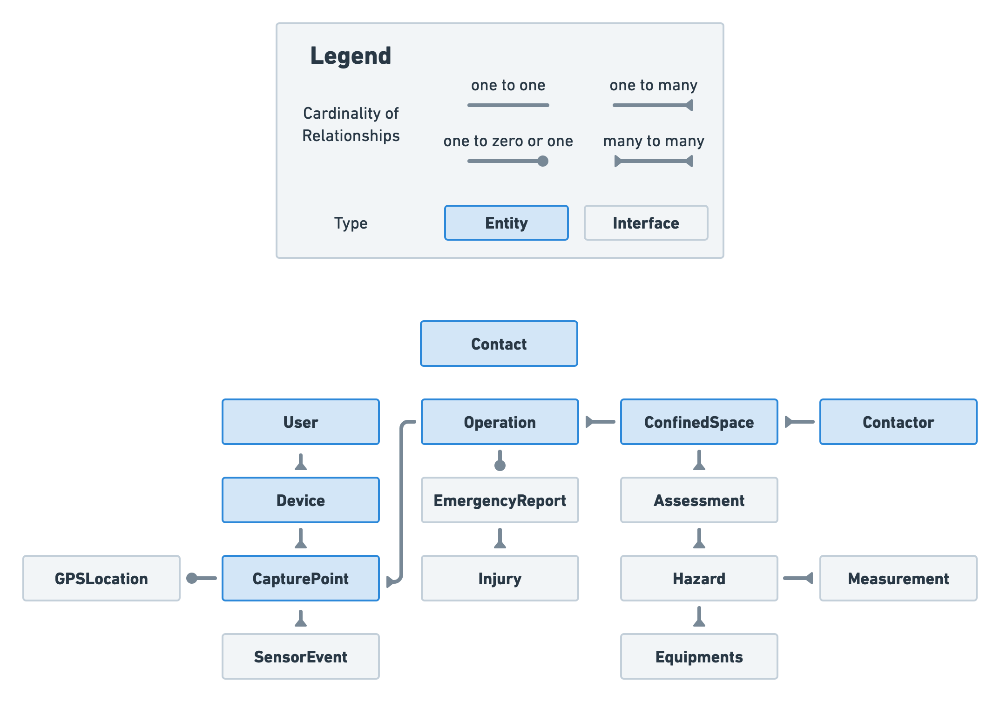
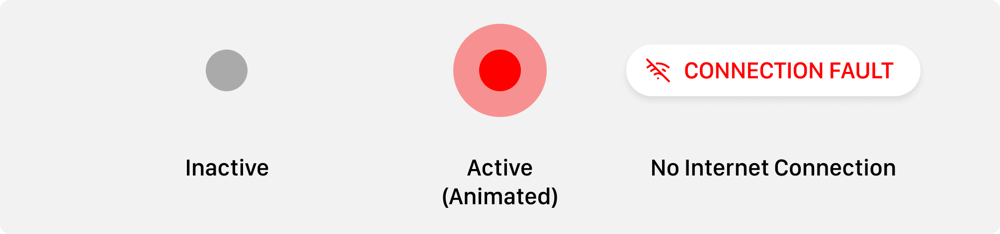

<!-- Goal: 12 pages -->
# System Design

<!-- TODO: Rewrite -->
As the whole ecosystem is made up of many smaller software pieces discussed in the previous part *[3 Capabilities](#capabilities)* many design considerations had to be made. In this chapter I will walk over all the important concepts I have come up with and will go into more detail the more this chapter progresses. First I will lay out general concepts on how the application should function. Later I will get more specific and explain the individual software libraries and technologies used in order to accomplish the previously set goals.

## Application Flows

For a good user experience the interactions with the software were designed before developing the applications. Each flow represents the flow in which firemen, operators, workers and employers might work with the software.

**Version 1 and 2** are rather limited -- their whole purpose is to simply signal and remind the fireman inside the fire trucks of any ongoing confined spaces operations. When approved by the operators they are able to press a simple button on their device that then gets transmitted to all vehicles. As there are multiple operators inside the dispatchment center their triggering applications will also be informed about the status change.

**Version 3 and above** process more complex routines which I will explain in the following chapters:

### Register new Contractor

Local companies are required by law to either have an emergency responder on their own or have a contract with one @bellefleur_2022_in. Each new contractor of the fire department will be able to get registered inside the system. When creating a new client inside the software a form should ask for relevant information about the work place. As there has been a huge gab in the detail of any contractors' documentation about their work sites @bellefleur_2022_in some information should be made mandatory to be provided, to ensure consistency across all confined spaces. The documentation of some ranged from complete folders of documents, hazards assessments to almost no information at all @bellefleur_2022_in.

- Name of the company
- Address
- Contact information for the company
- A list of the identified confined spaces where work might get carried out

A copy of the contract and any other documents regarding the company should be uploaded to the system to remove the need for the operator to go through any folder and look for the documents. A physical copy should always be kept on hand in case of a system failure.
<!-- NOTE: Keep all documents in one place -->

What exactly is needed to register a new confined space will be further discussed in the next section [*Adding a Confined Space*](#adding-a-confined-space).

<!-- TODO: 3 year hazard report warning -->
<!-- TODO: Confirmation E-Mail for the Contractor to sign that the information is correct. -->


### Adding a Confined Space

Before an operation can be scheduled the confined space needs to be registered. This process is done by the operator entering the information the contractor provided. The operator will be guided through this process to ensure all relevant information is captured.

- Name of the confined space
- Location of the entry point
- Lock-out board location
- Measurement taken before entry
- Hazards to be expected in the confined space
- Date of the hazard assessment
- Mitigation measures to be taken
- Equipment to be used
- Emergency equipment to be used
- Further documentation and files

After entering the confined space into the system a verification about the correctness of the information will be requested from the company through an automated e-mail or SMS.

Should the date of the hazard assessment be older than the maximum 3 years -- the operator is obliged to ask for an updated report.

### Updating a Confined Space

Besides adding a confined space the operator should be able to update the information about a confined space. This may be needed when some conditions inside the confined space changed 

### Schedule Confined Space

<!-- What information about a confined space is required within the applcations? -->

<!-- NOTE: Each confined space needs to hold relevant information that should be concise and free of duplication. For the optimal application I have come up with a data model that should be extendable f -->

<!-- The chapter should describe the applications on a high level. Not the implementation. No languages and no code! -->

The employer should be able to schedule a confined space operation. This should either be possible by calling the operator, handing in a filled out form or by using the *Worker* application.

Scheduling the operations requires some important information:

1. Which Confined Space is the operation going to take place?
2. When is the Operation going to take place?
3. Who to contact in case of an emergency?
4. Who is going to enter the confined space?
   - What is the maximum number of workers entering the confined space at any time?
5. What work is going to be performed?
6. Additional Information?
   - Hazards that could occur that are not covered by the confined space?
   - Rescue Equipment to the equipment that has been covered by the confined space?

Should the selected space's hazard report be older than the maximum age of three years a warning is displayed that the employer first needs to provide an updated hazard report, or he needs to reaffirm that the information is still up-to-date.

After filling out all the information a review page should give a summary of the data that has been entered.

Once the operation has been scheduled the emergency contact will receive an e-mail or an SMS with the information provided in the form. By clicking on a link provided inside the e-mail or the SMS the emergency contact can confirm the captured information is valid.

### Entering a Confined Space

Any confined space operation has to be approved by the operators before someone is allowed entry. A request to enter a space can either be performed by calling in to one of the operators inside the fire department or by sending a request through the *Worker* application. Only if the confined space operation has been scheduled -- an entry can be approved. This gives the fire department and also the workers the confidence that all precautions have been met.

Should the entry be requested through the *Worker* application, the operator will receive a push notification asking him to give approval. In the time the operator needs to respond the one requesting the entry will be shown a waiting screen warning him to wait for approval. In case the operator is not responding the worker will be told to call in to the operator.

Each operation can be in one of eight different states:

  1. Scheduled
  2. Requested
  3. Canceled
  4. Approved
  5. Declined
  6. In Progress
  7. Emergency
  8. Completed

Once a request to enter the confined space has been made to the operators the request will either be approved or declined. A decline of the request may be caused due to a lack of information about the operation or a lack of emergency responders inside the fire department.

Both the cancelation and the decline of an operation require additional information to why it was called off. Most predominant reason being a valuation of the risks being off limits. But might also be due to a rescheduling of the operation or a lack of workers.

Each step gets documented with the time and date of the event. This will provide essential knowledge to prove the correct execution of each of the steps.

Should the whole fire department be busy with a huge emergency requiring all stuff the operators are able to decline all requests automatically and display a message to the *Worker* saying that operations are currently on hold.

### Declaring an Emergency

## Architecture

<!-- What is the architecture of this application? -->
  <!-- What do books recommend on how a good system architecture should look like? -->

<!-- How will the different applications communicate with one another? -->

<!-- TODO: How should the application data be modeled? ERD Diagram -->

<!-- Does the software needs to be scalable? -->

<!-- What should be the maximum cost of the ecostytem? -->

## Data Model

For the whole application I have come up with a complex data model. I have tried to capture the most relevant information and created room for expansion where necessary. Inside the data model distinctions between the actual entity and nested type interfaces are being made. The nested objects provide further structure thought the application, but unlike the entities these types are always stored inside an entity and therefor are not directly referenceable by any object. This helps with data persistence and is especially important for later verifying the correct handling of an emergency.

<!-- TODO: Add source -->


Each entity has a unique identifier and some metadata associated with it. The metadata holds information like a timestamp -- when the entity was last updated `LastUpdated: Timestamp` and information about who performed that change `LastUpdatedBy: Ref(User)`. Later holding a reference to the user that performed the change. The names are purposely chosen to only reflect the latest change to an object as each entity owns a subcollection of the changes that have been made to it.

To keep data usage at a minimum the subcollection does not store complete snapshots of the object but only holds the changes that have been made to it. Besides the actual change this change snapshot will always include the previously mentioned `LastUpdated` and `LastUpdatedBy` fields. The Internet Engineering Task Force ((+IETF))^[The **IETF** or *Internet Engineering Task Force* is a standards body that focuses on developing and publishing standards for the open web. @ietfinternetengineeringtaskforce_2019_about] published an (+RFC)^[**(+RFC)** stands for *Request For Comments* and describes a standard published to the (+IETF). It is called *Request For Comments* as a standard is not directly recommended by the (+IETF) and requests to be evaluated by anyone @drjulianonions_2021_rfc, @nottingham_2018_how. It first has to go through a number of stages before it should be used in production by anyone. @emberjs_rfc] that describes how one might store changes made to a JSON object in a standardized way. The standard has been published in April 2013 under the name "JavaScript Object Notion (JSON) Patch" ([RFC 9602](https://www.rfc-editor.org/rfc/rfc6902.html)) by Paul C. Bryan and Mark Nottingham. @bryan_2013_rfc, @dharmafly_2022_json

The standard has been adapted by many existing libraries for all major programming languages. And is therefor fairly straightforward to implement into the application.

As an example for the following object...

```json
{
  "foo": "abc",
  "bar": "def"
}
```

... a change using the [RFC 9602](https://www.rfc-editor.org/rfc/rfc6902.html) standard might look like this:

```json
[
  { "op": "replace", "path": "/bar", "value": "abc" },
  { "op": "remove", "path": "/foo" }
]
```

Each change inside the array describes one of 6 different case-sensitive operations that can be performed on the original data object. The operations `op` are:

  - `add`: Add a new property to the object.
  - `remove`: Remove a property from the object.
  - `replace`: Replace the value of a property.
  - `move`: Move a property to another location.
  - `copy`: Copy a property to another location.
  - `test`: Test that a property exists and has the expected value.

Only the `add`, `remove` and `replace` operations are of interest to the application.

With all of that information a history graph can be created and traversed to the user that created or modified the object at any point in time.

### Contact

A contact holds relevant information about a person. It stores the contacts name, address, phone number, email address and a selection of predetermined types to better identify the duty of the contact. As the contact information plays an important role with the traceability of information the contact object is not allowed to be deleted. <!-- TODO: Figure--> The contact entity in Figure X shows no connection to any other objects as the contact entity can be all thought the models.

### Users

Every person that wants to interact with the application has to be a registered user. Users have a role assigned to them. The role determines what operations the individual user is allowed to perform and which parts of the application he is able to see.

<!-- TODO: See where this goes -->
Optional^[Present in many modern programming languages an **optional value** is one that can deliberately be omitted. The absence of a value is often denoted by a special `undefined`, `nil` or `null` value. A type annotation often uses a `?` to indicate that the value is optional. @microsoft_2022_documentation, @appleinc_the]


<!-- TODO: What happens on user deletion -->

### Contractors
### Confined Spaces

  - Assessment
    - Notification when older than 3 years
  - Hazard
  - Measurement
  - Equipment

### Operations

- Ideas
  - Approved by User
- Emergency Report
- Injury

### Capture Points

- Sensor Event
  - Ability to connect on sight sensors

## Quality

<!-- What qualitiy / security standards need to be set? -->
  <!-- What defines a software to be of high quality? - See:  Ensuring the Software Quality for Critical Infrastructure Objects -->
  
  <!-- What happens when there is no network connection? -->

### Reliability

<!-- How should issues and crashes be handled? -->
<!-- What Fallback is there in case of a malfuntion or a complete system outage? -->

### Safety
  <!-- What are common errors that need to be prevented? e.g. User error (Incorrect use), Network Connectivity -->
  <!-- How is the application protected against hackers? -->
  <!-- What attack surfaces does the application poses? -->
  <!-- What are the consquences of someone breaching different parts of the system -->
  <!-- How can this be prevented? -->

  <!-- How is future provness guaranteed? -->

## Interface Design

For the User Interface^[The **User Interface** ((+UI)) describes the visual style of an application @dumont_2021_ui] ((+UI)) and the User Experience^[The **User Experience** ((+UX)) describes the functionality of an application. As to *what steps need to be taken in order to perform a certain task*. When talking about a "good" (+UX) that generally means that a software is intuitive and easy to use.] ((+UX))

#### Terminal

abc



#### Trigger

#### Dispatcher

For the dispatchment application I have come up with a complete design system that should bring uniformity to all screen and 

<!-- TODO: Use the following passage somewhere -->
<!-- NOTE: A rescue is a balancing act between speed and safety. No rescue comes without risks that is why it is important to have only the most demanding information visiable that is vital to perform an operation. -->

#### Worker

<!-- How should the UI function? -->
<!-- How can incorrect usage of the application be prevented? How does the UI reflect these protections? -->
<!-- What DevOps Pipelines need to be developed? -->
<!-- What pages are needed for the Dispatcher? -->
<!-- UI components and their use cases? -->

<!-- How should Forms in the Dispatcher application should look like? What data is needed by the operator? -->
