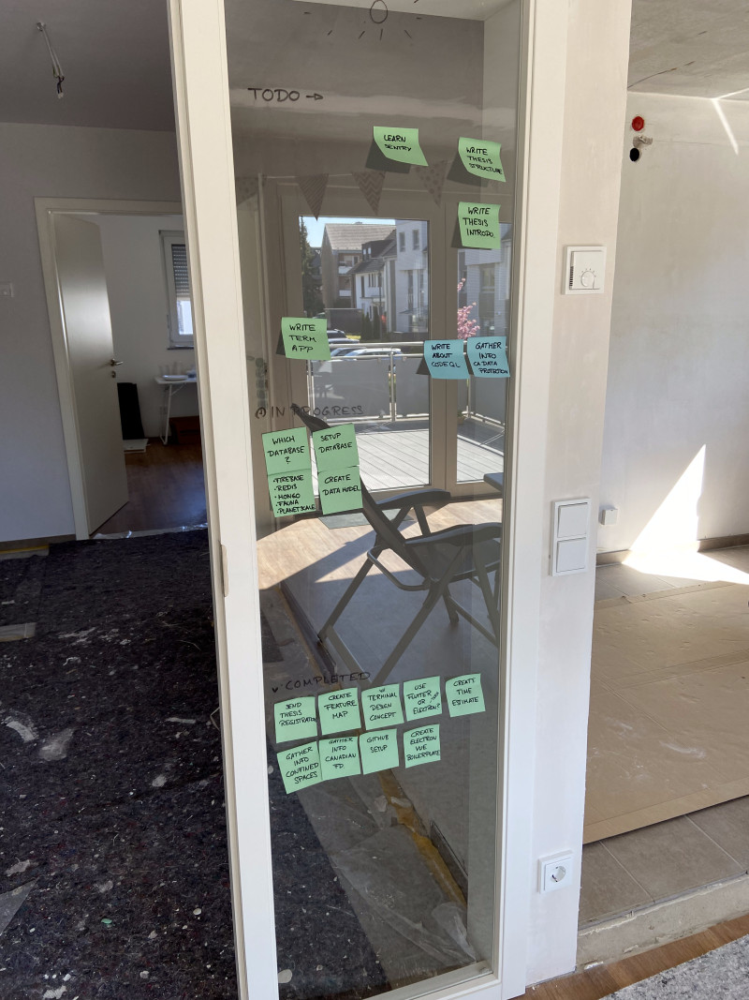
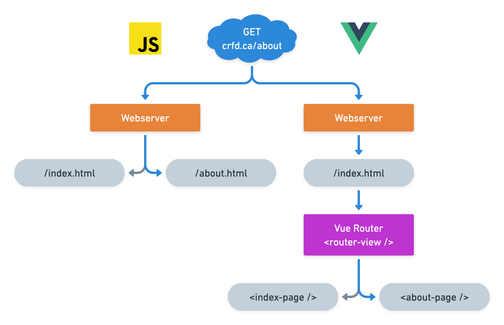

<!-- Goal: 1500 Words -->
# Implementation

Besides conceptualizing the application, I have fully developed the first two versions of the applications. As time ran out at the end the 3rd and 4th versions are still in development and need some refinement to be completed. In the following sections I have documented all software I have implemented so far:

## Project Management

As time for this thesis is limited a strict project management strategy was needed. In a process called Kanban every task was broken down into smaller more manageable steps that provided a clear roadmap for each of the releases. In the end time was at a premium, so I decided to switch to a more agile development approach. Which meant that I had to implement both version 3 and 4 at the same time to get some presentable results.

{#fig:kanbanBoard height=400px}

<!-- How have I designed the application road map? -->
<!-- What project management tools have I used in order to keep track of my tasks? Notion, GitHub Issues, Tags, Gantt-Chart -->

## Interface Design

To speed up the development process most of the User Interface I have designed beforehand in an application called "Figma". I have tried to come up with a unique and intuitive design that is easy to understand. Colors are kept at a minimum to not distract from what is most important to the person using the application.

## Software

Names of the different software reflect their repository names on GitHub.

<!-- What does the electron-vite-fusion boilerplate do? -->
### electron-vite-fusion

{#fig:electronViteFusionLogo height=2.5cm}

As multiple applications relied up on Electron as their application core I first created a boilerplate to more quickly get started with writing the actual applications. The boilerplate which can be found under [https://github.com/KuhlTime/electron-vite-fusion](https://github.com/KuhlTime/electron-vite-fusion) includes a build tool called "Vite" @you_2022_vite. Depending on the environment the application is run in (development/production) the Electron app either servers content from a local development server or uses the distribution build which includes the compiled VueJS application. The development server has hot module replacement enabled so that the application can be reloaded without a full reload of the actual webpage shown inside the Electron window. A package called "electron-builder" was used to automatically generate the binaries to be installed on the target platforms.
  <!-- Code Signing -->

### cs-trigger


### cs-terminal

<!-- What features / code snippets need deeper explaination? -->
  <!-- What are these features / sntippets used for? -->
  <!-- What language are they written in? -->
  <!-- How do these feature / snippets function? -->

<!-- How much data is firestore using when on cellular? Make some tests to see how much data is beeing used -->
  <!-- How are the security rules defined? -->
  <!-- How is data being stored? -->

### cs-firebase-manager

This repository holds the security rules for the Firestore Database as well as the Firebase Functions that are to be executed. On each push to the repository two GitHub actions are run to automatically deploy the code to Firebase. One for the

### cs-models

### cs-dispatcher

Instead of using an Electron window to display the dispatchment application. I have gone for a complete web solution. The application is hosted on a server that is accessible from the internet. Changes to the repository are automatically being uploaded to the server. 

Equally, to all the other UI applications I am using VueJS as the frontend framework. As this is the largest application of them all, multiple pages are of need. For this I used a VueJS standard library called "vue-router". Instead of providing each endpoint with its own HTML page, every request made to the website is automatically forward to the index page of the website. This is called a single page application as there is only one page that is effectively being displayed. Every route change is captured by the vue-router and triggers an on-page component to be loaded inside the `<router-view />` tag. Figure @fig:vueRouter shows the difference between a "normal" website that does not use a single page for its content (left) and the vue-router (right).

{#fig:vueRouter}

All routes are defined in a settings object and passed to a new instance of the router. For manipulating the (+UI) or restricting access to certain pages each route has special metadata object to define additional properties. The code snippet below shows the definition of a single route.

```typescript
{
  path: '/',
  name: 'home',
  component: () => import('@/pages/Dashboard/Home.vue'),
  meta: {
    title: 'Home',
    requiresAuth: false,
    hidden: false,
    icon: HomeIcon,
    hideFromCommandPalette: false
  }
}
```

Before navigating to a new page the router checks if the route requires authentication. If so, the user is only granted access to the page if he has been successfully logged in, if he is not logged in he will automatically be redirected to the login `next({ name: 'login' })` page. If the user is logged in or the page he is trying to access does not require him to be logged in, the route is allowed to be accessed `next()`.

```typescript
const authGuard = (
  toRoute: RouteLocationNormalized,
  fromRoute: RouteLocationNormalized,
  next: NavigationGuardNext
) => {
  if (toRoute.meta.requiresAuth) {
    isAuthenticated() ? next() : next({ name: 'login' })
  } else {
    next()
  }
}
```

Because the source code on a website is publicly accessible and can be manipulated the routers' authentication guard is able to be circumvented by a potential bad actor. The attacker is though not able to gain any data, because fetching data from the Firestore database would require him to be a valid user that checks out against the Firebase's security rules (JWT token is invalid).


<!-- Text Block width: 345pt -->
\begin{table}
All components used by the application have been custom designed inside of Figma and then realized with VueJS. 
Here are some of the components used inside the application:
\newline
\begin{center}
\begin{tblr}{ | Q[165pt,valign=t] | Q[154pt,valign=h] | }
  \hline
  \textbf{Component} & \textbf{Image} \\
  \hline

  \textbf{Avatar:}
  Displays the user's profile picture and name. The component takes the users \texttt{name}, \texttt{image}, \texttt{email} and the \texttt{avatar-size} as arguments. Should no \texttt{image} be set the \texttt{email} is checked for a Gravatar image. The \texttt{avatar-size} is used to define the size of the image. Depending on the size -- on hover the full-name or the initials get shown. &
  Normal Avatars \newline
  \includegraphics[width=154pt]{avatar-nm}
  XL Avatars \newline
  \includegraphics[width=154pt]{avatar-xl}
  \newline \emph{Left}: No Image Found \newline \emph{Middle}: Gravatar \newline \emph{Right}: Custom Image (Hover) \\
  \hline

  \textbf{Box:} A Box component is used to provide a common interface throughout the application. Each Box has a footer to display any state information on the left and buttons on the right. State information may be some validation error or a success message when the boxes content was executed without errors. &
  \includegraphics[width=154pt]{box} \\
  \hline

  \textbf{Button:} Buttons inside the applications come in 6 different flavors. Critical operations are denoted with a bright red color and all uppercase text. Optionally an icon can be set that is displayed in front of the buttons text. &
  \includegraphics[width=154pt]{button-primary}
  \newline
  \includegraphics[width=154pt]{button-secondary}
  \newline
  \includegraphics[width=154pt]{button-critical} \\
  \hline

\end{tblr}
\end{center}
\caption{\emph{Dispatcher} Component Library}
\end{table}


\begin{table}
\begin{center}
\begin{tblr}{ | Q[165pt,valign=t] | Q[154pt,valign=h] | }

  \hline

  \textbf{Command Palette:} &
  \includegraphics[width=154pt]{palette} \\
  \hline

  \textbf{Detail:} &
  \includegraphics[width=154pt]{box} \\
  \hline

  \textbf{Dropdown:} &
  \includegraphics[width=154pt]{box} \\
  \hline

  \textbf{Hazard Diamond:} &
  \includegraphics[width=154pt]{hazard-diamond} \\
  \hline

  \textbf{Input:} &
  \includegraphics[width=154pt]{box} \\
  \hline

  \textbf{Label:} &
  \includegraphics[width=154pt]{box} \\
  \hline

  \textbf{Message:} &
  \includegraphics[width=154pt]{box} \\
  \hline

  \textbf{Modifier:} &
  \includegraphics[width=154pt]{box} \\
  \hline

  \textbf{Path:} &
  \includegraphics[width=154pt]{box} \\
  \hline

  \textbf{Tooltip:} &
  \includegraphics[width=154pt]{box} \\
  \hline
\end{tblr}
\end{center}
\end{table}

<!-- DataTable component -->

<!-- Router -->
  <!-- Route Guard -->
<!-- i18n -->

\newpage
### cs-worker
