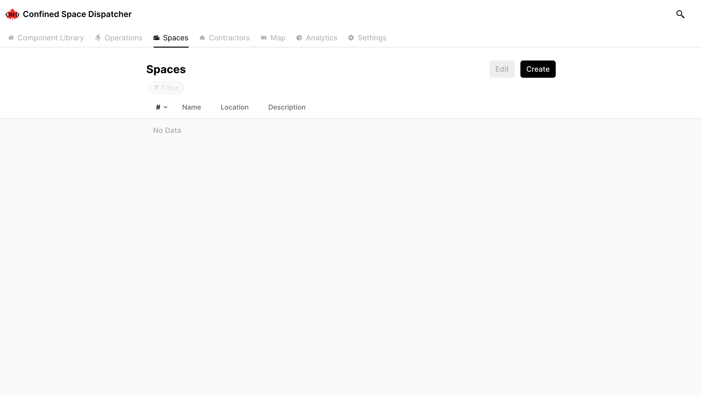
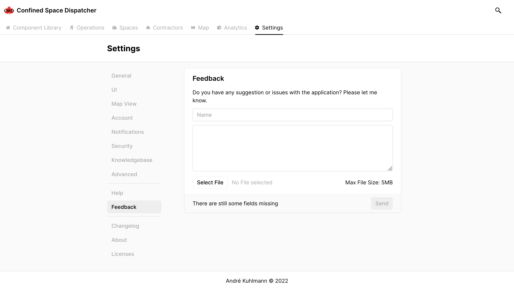

<!-- Goal: 1500 Words -->
# Implementation

Besides conceptualizing the application, I have fully developed the first two versions of the applications. As time ran out at the end the 3rd and 4th versions are still in development and need some refinement to be completed. In the following sections I have documented all software I have implemented so far:

## Project Management

As time for this thesis is limited a strict project management strategy was needed. In a process called Kanban every task was broken down into smaller more manageable steps that provided a clear roadmap for each of the releases. In the end time was at a premium, so I decided to switch to a more agile development approach. Which meant that I had to implement both version 3 and 4 at the same time to get some presentable results.

{#fig:kanbanBoard height=400px}

<!-- How have I designed the application road map? -->
<!-- What project management tools have I used in order to keep track of my tasks? Notion, GitHub Issues, Tags, Gantt-Chart -->

## Interface Design

To speed up the development process most of the User Interface I have designed beforehand in a user interface design application called "Figma". I have tried to come up with a unique and intuitive design that is easy to understand. Colors are kept at a minimum to not distract from what is most important to the person using the application. Examples of the interface are shown in Figure @fig:indicatorStates and Figure @fig:figmaMockup.

{#fig:indicatorStates}

{ #fig:figmaMockup }

## Software

Following each software implementation is explained in greater detail. The chapters are named like their repository counterparts.

### electron-vite-fusion

{#fig:electronViteFusionLogo height=2.5cm}

As multiple applications relied up on Electron as their application core I first created a boilerplate to more quickly get started with writing the actual applications. The boilerplate which can be found under [https://github.com/KuhlTime/electron-vite-fusion](https://github.com/KuhlTime/electron-vite-fusion) includes a build tool called "Vite" @you_2022_vite. Depending on the environment the application is run in (development/production) the Electron app either servers content from a local development server or uses the distribution build which includes the compiled VueJS application. The development server has hot module replacement enabled so that the application can be reloaded without a full reload of the actual webpage shown inside the Electron window. A package called "electron-builder" was used to automatically generate the binaries to be installed on the target platforms.
  <!-- Code Signing -->

### cs-trigger and cs-terminal

Based on the design I have created in Figma and the *electron-vite-boilerplate* the application is fully operable and can be used by the fire department. A continuous deployment action on GitHub is responsible for automatically deploying the application to the target platforms (macOS, Linux, Windows) and providing GitHub with the executables which are made available to download through the releases' section of the repository.

{#fig:githubActionCsTrigger}

As seen in Figure @fig:githubActionCsTrigger the application has to be compiled for each target platform individually. For that GitHub Actions can define a matrix of options an action can be executed with.

```yaml
jobs:
  build:
    strategy:
      matrix:
        os:
          - macos-latest
          - ubuntu-latest
          - windows-latest
    runs-on: ${{ matrix.os }}
    ...
```

The `build` job will therefor be executed on three different runners (servers).

### cs-firebase-manager

This repository holds the security rules for the Firestore Database as well as the Firebase Functions that are to be executed. On each push to the repository two GitHub Action workflows are run to automatically deploy the code to Firebase.

#### Functions

As of now there are two lambda functions enabled.
The first will synchronize the settings of the Firestore users document with the user data in the Firebase Authentication service.
The second lambda function can be triggered by an HTTP POST request made to the `/createNewUser` endpoint. The function checks that the user making the request belongs to the Administrator role. If so both a Firebase Authentication User and a new Firestore document with the users unique identifier `uid` is created. On creation a new user is assigned a randomized token generated using the `uuid` NPM package. The user will then be sent an email with a link to the registration page and the generated token as a query parameter.

```HTTP
https://crfd.ca/verify?email=andre@kuhlti.me&token=some_random_token
```

For the email that is sent out to a new user I am using a service called Postmark @activecampaignllc_postmark which allows one to sent out 100 emails per month for free. Using email templates the emails can be pre-styled and filled with content by naming the variables in the template. A variable might be used like follows: `<p>{{{example_variable}}}</p>`. 

{#fig:email width=400px}

#### Security Rules

The security rules are checked against a large set of test cases that all need to be passed. These test cases all try to perform CRUD^[**CRUD** stands for **Create**, **Read**, **Update** and **Delete** and are different kind of operations that can be performed on a database] operations on different documents inside the Firestore database. The tests can either be run on device using the `npm run test` command or get executed automatically when the rules are pushed to the GitHub repository. In order for Firebase to test the rules an emulation service needs to be executed. This will spin up a fake Firebase emulator inside which the rules can be tested without causing any harm to the real Firebase service. The action will be executed on a Linux machine and contains the following steps:

  1. Clone the repository to the runner instance
  2. Setup Node.JS
  3. Install the NPM packages
  4. Setup Java (needed for the emulator)
  5. Install the Firebase Emulator Suite
  6. Start the emulator
  7. Perform the tests
  8. If tests passed: Deploy the rules to Firebase

### cs-models

All applications are written mostly in TypeScript or JavaScript. To ensure interoperability between the different applications I have created a NPM package that can be easily imported and used inside all applications. The package is automatically distributed to the official NPM registry and can be installed by running the following command:

```shell
npm install @crfd/cs-models
```

On every version tag assigned to a commit the package is then automatically bundled and uploaded by a GitHub Action workflow. The workflow installs all packages and runs the TypeScript compilation. The upload is then handed over to a third party action. In order to sign in to the correct NPM account an API token `NPM_TOKEN` has to be provided to the action. The token is stored inside the repository secrets,

```yaml
- name: Publish to NPM
  uses: JS-DevTools/npm-publish@v1
  with:
    access: public
    token: ${{ secrets.NPM_TOKEN }}
```

### cs-dispatcher

Instead of using an Electron window to display the dispatchment application. I have gone for a complete web solution. The application is hosted on a server that is accessible from the internet. Changes to the repository are automatically being uploaded to the server. 

Equally, to all the other UI applications I am using VueJS as the frontend framework. As this is the largest application of them all, multiple pages are of need. For this I used a VueJS standard library called "vue-router". Instead of providing each endpoint with its own HTML page, every request made to the website is automatically forward to the index page of the website. This is called a single page application as there is only one page that is effectively being displayed. Every route change is captured by the vue-router and triggers an on-page component to be loaded inside the `<router-view />` tag. Figure @fig:vueRouter shows the difference between a "normal" website that does not use a single page for its content (left) and the vue-router (right).

{#fig:vueRouter}

All routes are defined in a settings object and passed to a new instance of the router. For manipulating the (+UI) or restricting access to certain pages each route has special metadata object to define additional properties. The code snippet below shows the definition of a single route.

```typescript
{
  path: '/',
  name: 'home',
  component: () => import('@/pages/Dashboard/Home.vue'),
  meta: {
    title: 'Home',
    requiresAuth: false,
    hidden: false,
    icon: HomeIcon,
    hideFromCommandPalette: false
  }
}
```

Before navigating to a new page the router checks if the route requires authentication. If so, the user is only granted access to the page if he has been successfully logged in, if he is not logged in he will automatically be redirected to the login `next({ name: 'login' })` page. If the user is logged in or the page he is trying to access does not require him to be logged in, the route is allowed to be accessed `next()`.

```typescript
const authGuard = (
  toRoute: RouteLocationNormalized,
  fromRoute: RouteLocationNormalized,
  next: NavigationGuardNext
) => {
  if (toRoute.meta.requiresAuth) {
    isAuthenticated() ? next() : next({ name: 'login' })
  } else {
    next()
  }
}
```

Because the source code on a website is publicly accessible and can be manipulated the routers' authentication guard is able to be circumvented by a potential bad actor. The attacker is though not able to gain any data, because fetching data from the Firestore database would require him to be a valid user that checks out against the Firebase's security rules (JWT token is invalid).


<!-- Text Block width: 345pt -->
\begin{table}
All components used by the application have been custom designed inside of Figma and then realized with VueJS. 
Here are some of the components used inside the application:
\newline
\begin{center}
\begin{tblr}{ | Q[165pt,valign=t] | Q[154pt,valign=h] | }
  \hline
  \textbf{Component} & \textbf{Image} \\
  \hline

  \textbf{Avatar:}
  Displays the user's profile picture and name. The component takes the users \texttt{name}, \texttt{image}, \texttt{email} and the \texttt{avatar-size} as arguments. Should no \texttt{image} be set the \texttt{email} is checked for a Gravatar image. The \texttt{avatar-size} is used to define the size of the image. Depending on the size -- on hover the full-name or the initials get shown. \newline \newline \emph{Left}: No Image Found \newline \emph{Middle}: Gravatar \newline \emph{Right}: Custom Image (Hover) &
  Normal Avatars: \newline
  \includegraphics[width=154pt]{avatar-nm}
  XL Avatars: \newline
  \includegraphics[width=154pt]{avatar-xl} \\
  \hline

  \textbf{Box:} A Box component is used to provide a common interface throughout the application. Each Box has a footer to display any state information on the left and buttons on the right. State information may be some validation error or a success message when the boxes content was executed without errors. &
  \includegraphics[width=154pt]{box} \\
  \hline

  \textbf{Button:} Buttons inside the applications come in 6 different flavors. Critical operations are denoted with a bright red color and all uppercase text. Optionally an icon can be set that is displayed in front of the buttons text. \newline \newline \emph{Left}: Button with Icon \newline \emph{Middle}: Button without Icon \newline \emph{Right}: Button without Icon (Disabled) &
  Primary:
  \includegraphics[width=154pt]{button-primary}
  Secondary:
  \newline
  \includegraphics[width=154pt]{button-secondary}
  Critical:
  \newline
  \includegraphics[width=154pt]{button-critical} \\
  \hline

\end{tblr}
\end{center}
\caption{\emph{Dispatcher} Component Library}
\end{table}


\begin{table}
\begin{center}
\begin{tblr}{ | Q[165pt,valign=t] | Q[154pt,valign=h] | }

  \hline

  \textbf{Command Palette:} The Command Palette is accessible throughout the whole application either by pressing the search button in the navigation bar or by pressing the hotkey \texttt{CMD}+\texttt{K} or \texttt{STRG}+\texttt{K} and provides an easy way to jump between pages or execute common actions. Each command has its own \texttt{Command} typescript model. Inside the model exists a \texttt{name}, an \texttt{icon} and a \texttt{action} property. The latter is holding a lambda function which gets executed when the user selects the particular command. Extending on the \texttt{Command} model are different command categories like \texttt{RouteCommand} that takes a vue-router route as a variable. Objects like \texttt{Space}s \texttt{Contractor}s \texttt{Operation}s stored inside the Database can be searched for as well. \newline \newline When the command palette opens up the search field is automatically selected. When entering a search string the list of avialable results will get filtered. &
  Command Palette:
  \newline
  \newline
  \includegraphics[width=154pt]{palette}
  \newline
  \newline
  Navigation Bar:
  \newline
  \includegraphics[width=154pt]{search-button} \\
  \hline

  \textbf{Detail:} Custom styled detailed box. Using a VueJS \texttt{<slot></slot>} element the content inside the detail can be customized. &
  \includegraphics[width=154pt]{detail-collapsed}
  \includegraphics[width=154pt]{detail-expanded} \\
  \hline

  \textbf{Select:} The selection element is a rather complex component that allows a user to select from a list of provided options. He can either scroll through the list of possible options or he can enter a value to filter the shown list. To make the experience more pleasant the element has some saddle animations. &
  \includegraphics[width=154pt]{select}
  \includegraphics[width=154pt]{select-extended} \\
  \hline
\end{tblr}
\end{center}
\end{table}


\begin{table}
\begin{center}
\begin{tblr}{ | Q[165pt,valign=t] | Q[154pt,valign=h] | }

  \hline

  \textbf{Hazard Diamond:} To more easily identify the hazards present inside a confined space a special hazard diamond (NFPA 704) component can be used. On hover the user can see a quick description of the present hazard and the respective risk level displayed in one of the four quadrants. &
  \includegraphics[width=154pt]{hazard-diamond}
  \includegraphics[width=154pt]{hazard-diamond-hover} \\
  \hline

  \textbf{Message:} There are two types of messages that can be displayed. One that is auto-dismissed when the message is just used to inform the user over some none critical process, or it can be permanent to only be dismissable by the user clicking the dismiss button. All messages are overlaid over the applications content in a special \texttt{<message-center />} component. &
  \includegraphics[width=154pt]{message} \\
  \hline

  \textbf{Path:} To display progress a multitude of different steps to better guide the user. &
  \includegraphics[width=154pt]{path} \\
  \hline
\end{tblr}
\end{center}
\end{table}

\newpage
To view the application and it's components yourself visit [dispatcher.kuhlti.me](https://dispatcher.kuhlti.me). 

Following are some screenshots from within the application:

{#fig:dispatcherMap}

{#fig:dispatcherSpaces}

{#fig:dispatcherNewSpace}

{#fig:dispatcherSettings}

<!-- DataTable component -->

<!-- Router -->
  <!-- Route Guard -->
<!-- i18n -->

\newpage
### cs-worker

The earlier prototype I have made of this application was made using Swift and SwiftUI. It already possessed the ability to send accelerometer, battery and location data back to the Firebase Firestore database. When the transmission was active the *Terminal* would indicate the active confined space operation. The user would be presented with a misuse warning whenever he would start his work session.

{#fig:workerPrototype height=400px}
