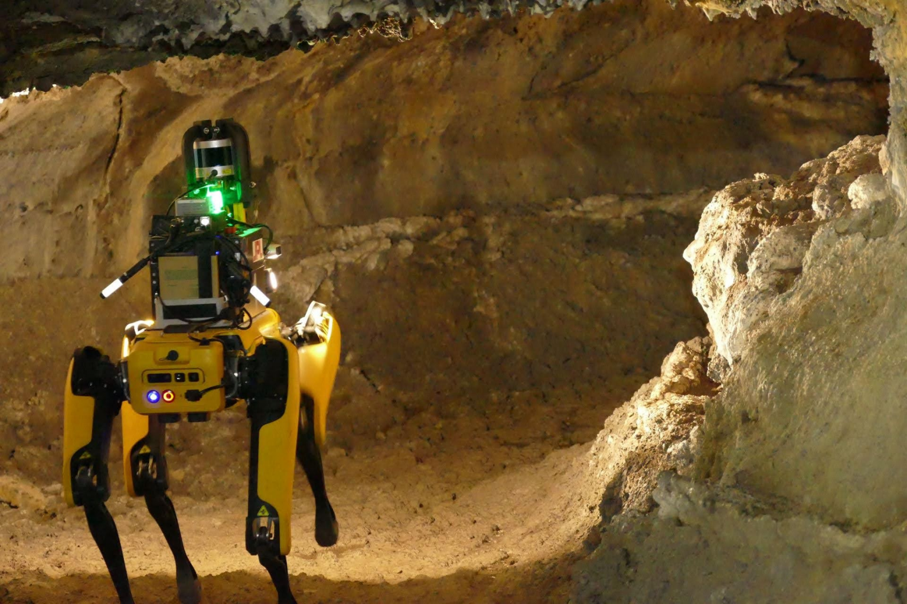

<!-- Goal: 400 words -->
# Conclusion

With this thesis I have managed to get more insight into the complete development cycle of a software system. I have learned a lot about researching for a particular topic and how I can gain knowledge to realize a solution to a complex problem. The application should drastically improve the workflow of the fire department as is. Because the fire department chief just left the office it remains to be seen if the development will be continued. In a future meeting I will help the fire department to install the application and discuss further maintenance issues with them.

In the future the application could be tested and connected with on-sight sensors as an interface for this kind of feature is already planned and implemented in the data model.

In this kind of software lies a great potential to further improve safety and security of both workers and confined spaces rescuers. That is why more and more services are being developed and projects with even greater autonomy are being planned and tested. In an E-Mail by the Engineer Luca Pohlmann of the German based Drägerwerk company (a company specializing in the manufacturing of medical and protection equipment) he told me that they are heavily researching in the area of automated inspection in confined spaces through the use of drones and robots.

{#fig:spot}

<!-- What have I achived with this thesis? -->
<!-- What have I learned? -->
<!-- What problems have I solved? -->
<!-- Will they further use this software for their operations? -->
